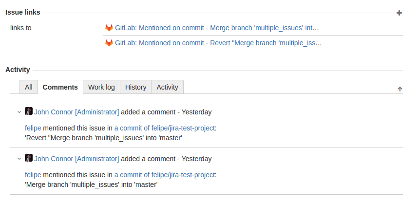
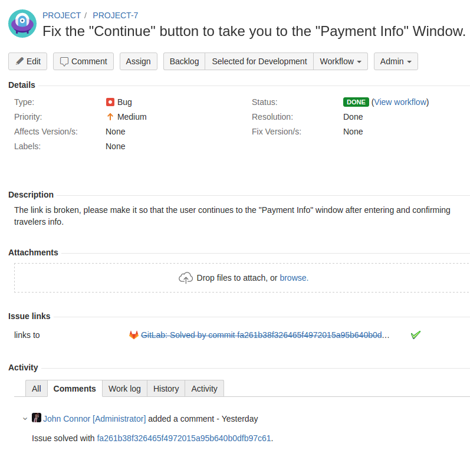

# GitLab JIRA integration

GitLab can be configured to interact with JIRA. Configuration happens via
user name and password. Connecting to a JIRA server via CAS is not possible.

Each project can be configured to connect to a different JIRA instance, see the
[configuration](#configuration) section. If you have one JIRA instance you can
pre-fill the settings page with a default template. To configure the template
see the [Services Templates][services-templates] document.

Once the project is connected to JIRA, you can reference and close the issues
in JIRA directly from GitLab.

## Table of Contents
* [Referencing JIRA Issues from GitLab](#referencing-JIRA-issues)
* [Closing JIRA Issues from GitLab](#closing-JIRA-issues)
* [Configuration](#configuration)

### Referencing JIRA Issues

When GitLab project has JIRA issue tracker configured and enabled, mentioning
JIRA issue in GitLab will automatically add a comment in JIRA issue with the
link back to GitLab. This means that in comments in merge requests and commits
referencing an issue, eg. `PROJECT-7`, will add a comment in JIRA issue in the
format:

```
 USER mentioned this issue in RESOURCE_NAME of [PROJECT_NAME|LINK_TO_COMMENT]:
 ENTITY_TITLE
```

* `USER` A user that mentioned the issue. This is the link to the user profile in GitLab.
* `LINK_TO_THE_COMMENT` Link to the origin of mention with a name of the entity where JIRA issue was mentioned.
* `RESOURCE_NAME` Kind of resource which referenced the issue. Can be a commit or merge request.
* `PROJECT_NAME` GitLab project name.
* `ENTITY_TITLE` Merge request title or commit message first line.



---

### Closing JIRA Issues

JIRA issues can be closed directly from GitLab by using trigger words, eg.
`Resolves PROJECT-1`, `Closes PROJECT-1` or `Fixes PROJECT-1`, in commits and
merge requests. When a commit which contains the trigger word in the commit
message is pushed, GitLab will add a comment in the mentioned JIRA issue.

For example, for project named `PROJECT` in JIRA, we implemented a new feature
and created a merge request in GitLab.

This feature was requested in JIRA issue `PROJECT-7`. Merge request in GitLab
contains the improvement and in merge request description we say that this
merge request `Closes PROJECT-7` issue.

Once this merge request is merged, the JIRA issue will be automatically closed
with a comment and a associated link to the commit that resolved the issue.


---



---


## Configuration

### Configuring JIRA

We need to create a user in JIRA which will have access to all projects that
need to integrate with GitLab. Login to your JIRA instance as admin and under
Administration go to User Management and create a new user.

As an example, we'll create a user named `gitlab` and add it to `JIRA-developers`
group.

**It is important that the user `GitLab` has write-access to projects in JIRA**

We have split this stage in steps so it is easier to follow.

---

1. Login to your JIRA instance as an administrator and under **Administration**
   go to **User Management** to create a new user.

     

     ---

1. The next step is to create a new user (e.g., `gitlab`) who has write access
   to projects in JIRA. Enter the user's name and a _valid_ e-mail address
   since JIRA sends a verification e-mail to set-up the password.
   _**Note:** JIRA creates the username automatically by using the e-mail
   prefix. You can change it later if you want._

     

     ---

1. Now, let's create a `gitlab-developers` group which will have write access
   to projects in JIRA. Go to the **Groups** tab and select **Create group**.

     

     ---

     Give it an optional description and hit **Create group**.

     

     ---

1. Give the newly-created group write access by going to
   **Application access > View configuration** and adding the `gitlab-developers`
   group to JIRA Core.

     

     ---

1. Add the `gitlab` user to the `gitlab-developers` group by going to
   **Users > GitLab user > Add group** and selecting the `gitlab-developers`
   group from the dropdown menu. Notice that the group says _Access_ which is
   what we aim for.

     

---

The JIRA configuration is over. Write down the new JIRA username and its
password as they will be needed when configuring GitLab in the next section.

### Configuring GitLab

JIRA configuration in GitLab is done via a project's **Services**.

#### GitLab 8.13.0 with JIRA v1000.x

To enable JIRA integration in a project, navigate to the project's
and open the context menu clicking on the top right gear icon, then go to
**Services > JIRA**.

Fill in the required details on the page as described in the table below.

| Field | Description |
| ----- | ----------- |
| `URL` | The base URL to the JIRA project which is being linked to this GitLab project. Ex. https://JIRA.example.com |
| `Project key` | The short, all capital letter identifier for your JIRA project. |
| `Username` | The user name created in [configuring JIRA step](#configuring-JIRA). |
| `Password` |The password of the user created in [configuring JIRA step](#configuring-JIRA). |
| `JIRA issue transition` | This is the ID of a transition that moves issues to a closed state. You can find this number under JIRA workflow administration ([see screenshot](img/jira_workflow_screenshot.png)). |

After saving the configuration, your GitLab project will be able to interact
with the linked JIRA project.


---

#### GitLab 6.x-7.7 with JIRA v6.x

_**Note:** GitLab versions 8.13.0 and up contain various integration improvements.
We strongly recommend upgrading._

In `gitlab.yml` enable the JIRA issue tracker section by
[uncommenting these lines][JIRA-gitlab-yml]. This will make sure that all
issues within GitLab are pointing to the JIRA issue tracker.

After you set this, you will be able to close issues in JIRA by a commit in
GitLab.

Go to your project's **Settings** page and fill in the project name for the
JIRA project:


---

You can also enable the JIRA service that will allow you to interact with JIRA
issues. Go to the **Settings > Services > JIRA** and:

1. Tick the active check box to enable the service
1. Supply the URL to JIRA server, for example http://JIRA.example.com
1. Supply the username of a user we created under `Configuring JIRA` section,
   for example `gitlab`
1. Supply the password of the user
1. Optional: supply the JIRA API version, default is version `2`
1. Optional: supply the JIRA issue transition ID (issue transition to closed).
   This is dependent on JIRA settings, default is `2`
1. Hit save


[services-templates]: ../project_services/services_templates.md
[JIRA-gitlab-yml]: https://gitlab.com/subscribers/gitlab-ee/blob/6-8-stable-ee/config/gitlab.yml.example#L111-115
